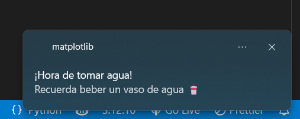
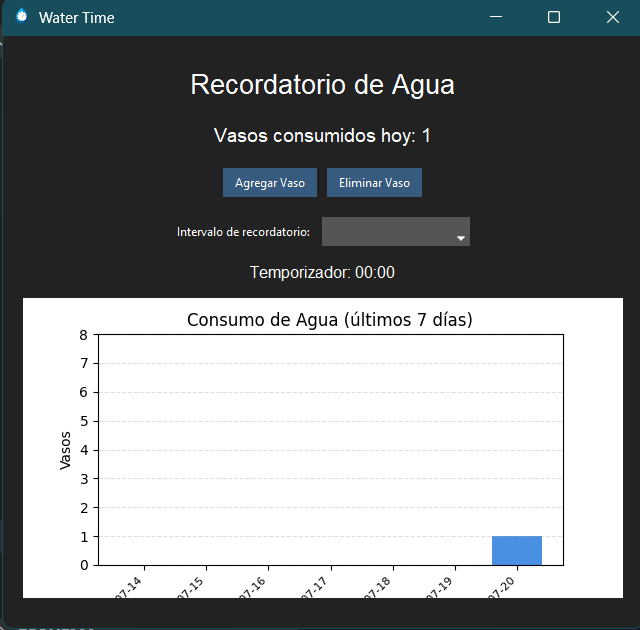
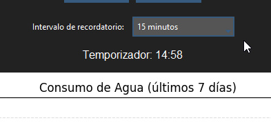

# 💧 Water Time - Recordatorio para Beber Agua

**Water Time** es una aplicación de escritorio desarrollada en Python que ayuda a los usuarios a mantenerse hidratados mediante recordatorios visuales y notificaciones periódicas. Ofrece un diseño moderno, estadísticas de consumo y funciones fáciles de usar.

---

## 🖼️ Capturas de Pantalla

### Notificación de Recordatorio


### Interfaz Principal


### Temporizador Activo


---

## 🎯 Funcionalidades

- ⏰ Temporizador configurable para recibir recordatorios de tomar agua.
- 📊 Gráfico de consumo semanal de vasos de agua.
- ➕ Botón para agregar vasos consumidos.
- ➖ Botón para eliminar vasos agregados por error.
- 📝 Historial automático guardado en `historial_consumo/historial_agua.json`.
- 🌙 Interfaz moderna, minimalista y con modo oscuro.
- 📢 Notificaciones motivacionales visuales.

---

## ⚙️ Tecnologías Usadas

- Python 3.12
- `tkinter` con tema `ttkbootstrap`
- `matplotlib` para gráficos
- `plyer` para notificaciones
- `json`, `os`, `datetime`, `threading`

---

## 📁 Estructura del Proyecto

Proyecto_Water_Time/
├── WaterTimeApp/
│ ├── main.py
│ ├── ui.py
│ ├── grafico.py
│ ├── historial.py
│ ├── recordatorio.py
│ ├── config.py
│ ├── assets/
│ │ └── icono.ico
│ └── capturas/
│ ├── interfaz_principal.png
│ ├── notificacion.png
│ ├── temporizador.png
│ ├── historial_consumo/
│ └── historial_agua.json
│ ├── README.md
│ └── Manual_de_Usuario.pdf


---

## 🚀 Cómo Ejecutar

1. Asegúrate de tener Python instalado.
2. Instala los módulos requeridos:

```bash
pip install -r requirements.txt

Ejecuta el archivo principal:

python WaterTimeApp/main.py

👤 Autor
Desarrollado por Wendy Osorio
📧 Email: osoriowendy2000@gmail.com
